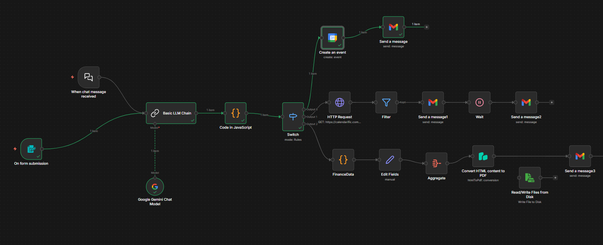

# 🚀 AI-Powered Office Automation (n8n + Google Gemini)

An intelligent, multilingual automation agent built on **n8n** that bridges the gap between natural language and complex business workflows. This system uses **Google Gemini** to process voice or text commands in English, Hindi, and Gujarati to manage schedules, track Indian festivals, and generate professional financial reports.


---

## 🧠 Core Features

* **Multilingual NLP:** Understands commands in **English, Hindi, and Gujarati** (e.g., *"tomorrow morning reminder"*, *"agla hafta meeting set karo"*, or *"kaale ledger report moklo"*).
* **Intent Recognition:** Automatically classifies user input into three specialized pipelines: `REMINDER`, `FESTIVAL`, or `FINANCE`.
* **Dynamic Entity Extraction:** Intelligently extracts dates, times, and specific items (like "ledger" or "cash book") from conversational text.
* **Automated Document Generation:** Generates branded, professional PDF financial reports for **Aethera Naturals** on demand.

---

## 🛠️ Technical Workflow Architecture

### 1. Input & AI Parsing Layer
* **Triggers:** The workflow starts via an **n8n Form** (for manual input) or a **Chat Trigger**.
* **The "Brain" (Basic LLM Chain):** Powered by **Google Gemini**, this node acts as a strict JSON API. It converts raw natural language into a structured schema:
    ```json
    {
      "intent": "FINANCE",
      "date": "2026-02-12",
      "item": "ledger"
    }
    ```
* **Data Validation:** A custom **JavaScript Code Node** sanitizes the AI output to ensure valid JSON before proceeding to the logic layer.

### 2. Logic Routing
The **Switch Node** acts as the central traffic controller, directing the payload to the appropriate branch based on the identified `intent`.

### 3. Execution Branches
* **Branch A: Reminders (Google Calendar)**
    * Creates a precise event in Google Calendar using extracted temporal data.
    * Sends a confirmation email via **Gmail** to the user.
* **Branch B: Festival Tracking (Calendarific API)**
    * Checks the **Calendarific API** for public holidays in India on the requested date.
    * If a festival is detected, a **Wait Node** schedules a celebratory greeting to be sent automatically on the morning of the event.
* **Branch C: Financial Reporting (Aethera Naturals)**
    * Aggregates credit/debit data and injects it into a custom **HTML/CSS template**.
    * **PDF Generation:** Uses the **PDF Generator API** to create a branded document.
    * **Distribution:** Automatically saves the file to a local directory (e.g., `D:/ssweb/automation/`) and emails it as an attachment.

---


## 📸 Workflow Visualization



*The complete automation pipeline showing input processing, intent routing, and parallel execution branches for reminders, festivals, and financial reporting.*


## 🎯 Workflow Architecture Diagram

**Workflow Architecture Diagram:**

n8n automation pipeline starting with form submission and chat message triggers flowing into a Basic LLM Chain powered by Google Gemini. The chain outputs structured JSON with intent, date, and item fields. A JavaScript Code Node validates the output before routing through a Switch Node based on intent type.

Three parallel branches execute:
- **Reminder branch:** Creates Google Calendar events and sends Gmail confirmations
- **Festival branch:** Queries Calendarific API and uses Wait nodes to schedule celebratory messages
- **Finance branch:** Aggregates data through FinanceData and Edit Fields nodes, converts HTML to PDF, and saves files to disk

Multiple Gmail Send Message nodes distribute outputs throughout the workflow with green connection lines showing data flow between components against a dark background.


## 📋 Tech Stack

| Component | Technology |
| :--- | :--- |
| **Automation Engine** | [n8n](https://n8n.io/) |
| **AI Model** | Google Gemini (via LangChain Integration) |
| **Programming** | JavaScript (Node.js) |
| **APIs** | Google Calendar, Gmail, Calendarific |
| **Reporting** | PDF Generator API, HTML5, CSS3 |
